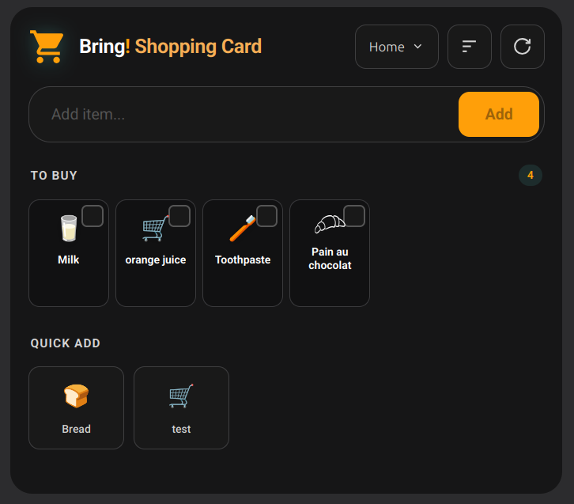

# Bring! Shopping Card for Home Assistant

[](https://hacs.xyz/)
[](https://github.com/costantinoai/bring-shopping-card/releases)
[](LICENSE)

A beautiful, modern shopping list card for [Bring!](https://www.getbring.com/) - fully integrated with Home Assistant.

> **Disclaimer**: This project is not affiliated with, endorsed by, or connected to Bring! Labs AG or the official Bring! app.

## Features

- **Beautiful Design** - Modern card that adapts to your Home Assistant theme
- **Visual Config Editor** - Configure all options through the UI
- **Real Product Images** - Fetches images from Bring CDN with emoji fallback
- **Multiple Lists** - Switch between your Bring! lists with a dropdown selector
- **Configurable Card Size** - Choose between small, medium, or large item cards
- **Drag & Drop Reordering** - Organize your shopping list your way
- **Dynamic Search** - Filter items as you type with live suggestions
- **Multiple Sort Options** - Manual, A-Z, By Category, Recently Added
- **Item Notes** - Add specifications like "2 lbs" or "organic"
- **Quick Add** - One-tap add from recently purchased items
- **Auto-Refresh** - Syncs every 60 seconds
- **Native Todo Integration** - Creates HA todo entities for automations

## Preview



## Installation

### HACS (Custom Repository)

Add it as a custom repository:

1. HACS → **Integrations** → **⋮** → **Custom repositories**
2. Add `https://github.com/costantinoai/bring-shopping-card` with category **Integration**
3. Download and restart Home Assistant

### Manual Installation

1. Download the [latest release](https://github.com/costantinoai/bring-shopping-card/releases)
2. Copy `custom_components/bring_shopping/` to `/config/custom_components/`
3. Copy `bring-shopping-card.js` to `/config/www/`
4. Add the resource in **Settings** → **Dashboards** → **Resources**:
   ```yaml
   url: /local/bring-shopping-card.js
   type: module
   ```
5. Restart Home Assistant
6. Add the integration and card as described above

## Card Configuration

Add the card to your dashboard using the visual editor or YAML:

```yaml
type: custom:bring-shopping-card
```

### Options

All options can be configured through the visual editor when you edit the card.

| Option | Type | Default | Description |
|--------|------|---------|-------------|
| `show_recently` | boolean | `false` | Show quick-add section with recent items |
| `show_available` | boolean | `false` | Show all items grouped by category |
| `max_quick_items` | number | `12` | Maximum items in quick-add section |
| `card_size` | string | `medium` | Item card size: `small`, `medium`, `large` |
| `sort_default` | string | `manual` | Default sort: `manual`, `alpha`, `category`, `recent` |

### Example

```yaml
type: custom:bring-shopping-card
show_recently: true
show_available: false
max_quick_items: 8
card_size: small
sort_default: category
```

## Multiple Lists

If you have multiple Bring! lists, a dropdown button appears in the card header. Click to switch between lists. Your selection is remembered per card instance.

## Todo Integration

This integration creates native Home Assistant todo entities for each of your Bring! lists. You can use these with:

- Home Assistant's built-in todo card
- Automations (e.g., "When I arrive at the store, show my shopping list")
- Voice assistants (Google Home, Alexa via HA)

## Comparison with the other Bring! integration

Home Assistant also has another Bring! integration documented here: https://www.home-assistant.io/integrations/bring

That project focuses on syncing Bring! lists into Home Assistant as todo lists (great for automations and basic UI), but it does not provide a full Bring!-like shopping list experience inside Lovelace.

This project is different:

- A dedicated Lovelace card that shows your active list items directly in the dashboard (with optional "recent" and "all items" views).
- Fast item editing from the card (add/remove/reorder/notes) to match the iOS/web app workflow more closely.
- Still provides native todo entities, so you get both: a rich UI *and* todo-based automations.

## Related Projects

Looking for a standalone solution without Home Assistant? Check out the companion project:

**[Bring! Widget](https://github.com/costantinoai/bring-widget)** - A standalone Docker server for local Bring! app and iframe widget embedding.

## Troubleshooting

### Card shows "Failed to connect to Bring! integration"

Make sure you've added the Bring! Shopping Card integration in Settings → Devices & Services.

### Items not syncing

The card refreshes every 60 seconds. Click the refresh button for immediate sync.

### Images not loading

Some items may not have images on Bring's CDN. The card falls back to emoji icons automatically.

## Development

```bash
# Install dependencies
npm install

# Build for production
npm run build

# Watch mode for development
npm run watch
```

## License

MIT License - see [LICENSE](LICENSE) for details.

This project is not affiliated with Bring! Labs AG.
